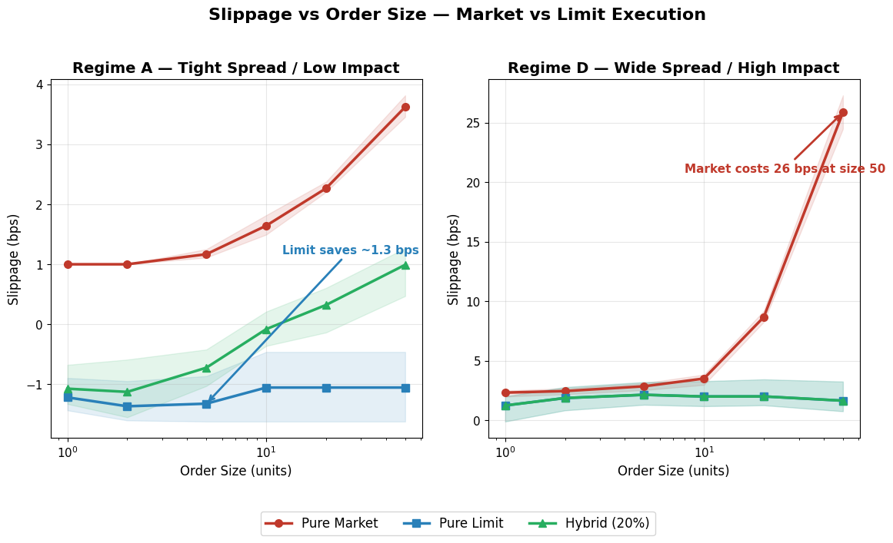

# Market Microstructure + Game-Theory Execution Toy Model

**Author:** Sacha Loeb

> When should a trader use a market order vs a limit order — and how does microstructure flip the answer?



[]()
[]()
[]()

## Reproduce in 60 Seconds

```bash
git clone https://github.com/sachaloeb/LOBSimulator.git
cd LOBSimulator
make run          # install → test → sweep (n=3) → game theory → LinkedIn assets
```

For full n=30 confidence intervals: `make all` (~8 min).

See [REPRODUCIBILITY.md](REPRODUCIBILITY.md) for detailed instructions, expected outputs, and seed-logging explanation.

## Repo Structure

```
LOBSimulator/
├── src/lob_simulator/
│   ├── types.py          ← Enums: Side, OrderType, OrderStatus
│   ├── state.py          ← Order, PriceLevel, LOBState, SimulatorSpec
│   ├── invariants.py     ← check_book_invariants(), BookInvariantError
│   ├── engine.py         ← Stateless MatchingEngine (FIFO matching, placement, cancellation)
│   ├── strategies.py     ← PureMarket, PureLimit, Hybrid execution strategies
│   ├── simulation.py     ← Tick-by-tick simulation loop (run_simulation)
│   ├── metrics.py        ← ExecutionMetrics, compute_metrics, aggregate_metrics
│   ├── runner.py         ← Full factorial sweep runner (run_sweep)
│   ├── game_theory.py    ← 2-player payoff model, best response, Nash equilibrium
│   └── charts.py         ← Slippage and fill-rate panel charts
├── configs/
│   ├── regimes.yaml      ← 4 regimes (A–D) with full parameters
│   ├── experiment_plan.md
│   └── payoff_model.md   ← Game-theory specification and assumptions (A1–A12)
├── notebooks/
│   ├── 00_main_analysis.ipynb  ← Full pipeline notebook (start here)
│   ├── 01_baseline_sweep.py    ← CLI: run sweep and produce charts
│   └── 02_game_theory.py       ← CLI: build payoff matrix and heatmap
├── scripts/
│   └── build_linkedin_assets.py ← Generate LinkedIn chart, table, and post draft
├── tests/                ← 36 tests (invariants, engine, strategies, metrics, simulation, game theory)
├── results/              ← CSV outputs (sweep_results, strategic_regimes_table)
├── charts/               ← Full diagnostic charts
├── linkedin/             ← LinkedIn-ready assets (main_chart, table, post_draft)
├── docs/
│   └── architecture.md   ← Dataflow diagram and module reference
├── Makefile              ← make run | make all | make test | make sweep | ...
├── REPRODUCIBILITY.md    ← Clone-to-results instructions
└── pyproject.toml
```

## Write-Up

### Assumptions

- Single asset, discrete time (time-sliced, fixed Δt ticks)
- Poisson order arrivals; FIFO queue within each price level
- Max 3 price levels per side (configurable)
- Linear price impact model

### Key Results

In the **tight-spread / low-impact** regime (A), limit orders earn negative slippage (~-1.3 bps) while market orders cost ~1.2 bps. Under **wide-spread / high-impact** (D), all strategies incur positive slippage, with market orders costing up to 26 bps at large sizes.

The game-theory layer finds Nash equilibria via iterated best response on a 2×3 payoff matrix (LP: tight/wide quote × LT: market/limit/hybrid). Equilibrium payoff magnitudes shift by ~10× across impact levels.

### Limitations vs Real Microstructure

#### 1. Single strategic agent (no endogenous LP response)

The model features one Liquidity Taker optimising against a fixed LP quoting policy. In real markets, multiple LPs compete dynamically, adjusting quotes in response to observed order flow and inventory. This simplification is acceptable because the research question focuses on the LT's strategy choice given a static environment, not on LP competition dynamics.

#### 2. Time-sliced discretisation (Δt artifact; not HFT-scale)

The simulator advances in fixed discrete ticks. Real markets operate in continuous time with nanosecond-resolution event streams. Intra-tick event ordering is lost, meaning simultaneous arrivals within a tick are resolved in an arbitrary sequence. This is sufficient for studying order-type tradeoffs at the strategic level but unsuitable for latency-sensitive HFT analysis.

#### 3. Linear memoryless impact (no Almgren–Chriss decomposition; no Hawkes)

Price impact is modelled as a linear, instantaneous function of net order flow with no memory. Real impact is concave, persistent, and decays over time (Almgren–Chriss temporary/permanent decomposition). Hawkes-process self-exciting dynamics, where trades beget trades, are also absent. The linear model suffices for qualitative regime comparisons but underestimates cost at large order sizes.

#### 4. FIFO queue only (no pro-rata; no queue-position model)

Orders at each price level are matched strictly first-in-first-out. Many real venues (e.g., CME options) use pro-rata or hybrid allocation. Queue position — a critical variable for limit order strategies in practice — is not explicitly modelled. FIFO is the most common equity model and adequate for the toy setting.

#### 5. No information asymmetry (adverse selection is a coefficient, not an endogenous mechanism)

Adverse selection enters as a fixed `impact_coeff` parameter rather than emerging from informed vs. uninformed trader interaction. Real adverse selection depends on the information content of order flow, time of day, and news arrivals. The coefficient-based approach isolates the mechanical effect of price impact without requiring a full information model.

#### 6. Single venue, single asset (no SOR; no cross-venue)

All trading occurs on one venue with one asset. Real execution involves smart order routing across fragmented venues with varying fee structures, latencies, and queue depths. Cross-asset hedging is also absent. The single-venue assumption keeps the strategy space tractable.

#### 7. Stationary regime parameters (no intraday regime-switching)

Regime parameters (spread, impact, arrival rates) are fixed for the duration of each simulation run. Real markets exhibit pronounced intraday patterns (wider spreads at open/close, regime shifts around news) and stochastic volatility. Stationarity is acceptable for studying the structural effect of regime differences in a controlled experiment.

#### 8. No empirical calibration (parameters are qualitative)

Regime parameters are chosen to span a qualitative range (tight/wide spread × low/high impact) rather than calibrated to historical tick data from a specific instrument. Absolute magnitudes of IS and slippage are therefore not directly comparable to real-world values. The model is designed for relative comparisons across regimes and strategies.

#### 9. IID Bernoulli cancellations (real cancels are bursty, state-dependent)

Resting order cancellations are modelled as independent Bernoulli draws each tick with a fixed probability. In practice, cancellation rates are highly state-dependent — spiking during price moves, news events, or when queue position deteriorates. The IID assumption underestimates the volatility of available liquidity but keeps the simulation tractable.

#### 10. Closed-form LP payoff proxy (not from a simulated LP P&L process)

The LP's utility is computed via a closed-form formula (spread earned minus quadratic adverse selection cost) rather than tracking a simulated LP's actual inventory, hedging costs, and realised P&L. This proxy captures the first-order spread-vs-impact tradeoff but misses inventory management, hedging, and the option value of resting orders. It is documented as an explicit simplification (Assumption A9 in `payoff_model.md`).